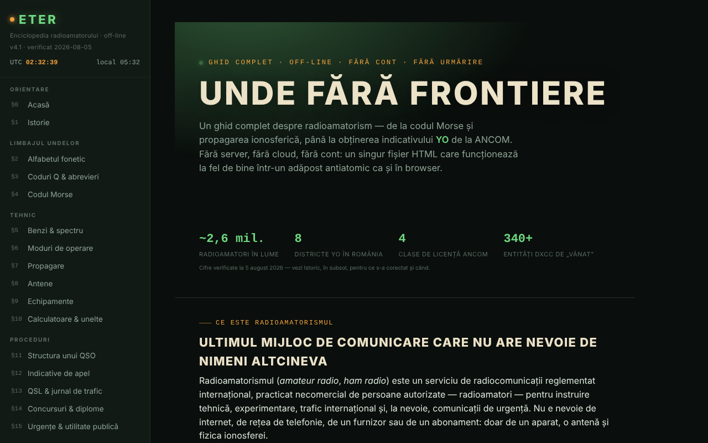

# ETER — Enciclopedia radioamatorului

Ghid complet despre radioamatorism, într-un singur fișier HTML: coduri Q, Morse, benzi, propagare, antene, indicative, licențiere ANCOM.

**Live:** https://chiuta.github.io/ETER/

## Ce este

ETER este o enciclopedie interactivă a radioamatorului (versiunea afișată în aplicație: v4.1, „verificat 2026-08-05"), organizată în 19 secțiuni numerotate §0–§18. Textul din aplicație o descrie ca „fără server, fără cloud, fără cont", iar conținutul se încarcă din același fișier HTML.

## Funcții

Secțiuni (meniul din stânga, ☰ pe mobil): Acasă, Istorie, Alfabetul fonetic, Coduri Q & abrevieri, Codul Morse, Benzi & spectru, Moduri de operare, Propagare, Antene, Echipamente, Calculatoare & unelte, Structura unui QSO, Indicative de apel, QSL & jurnal de trafic, Concursuri & diplome, Urgențe & utilitate publică, Devino radioamator YO, Test cunoștințe, Glosar A–Z.

Unelte verificate în cod / interfață:
- Codul Morse: traducător text ⇄ Morse cu redare audio, ascultător Morse din microfon (marcat experimental), antrenor Koch (runde de 25 de caractere), antrenor de trimitere cu tastă simplă; export/import de nivel.
- Calculatoare: lungimi de antenă, locator Maidenhead (cu „Folosește locația mea"), azimut și distanță (cu busolă live și overlay de cameră AR, opționale), frecvență ⇄ lungime de undă, referință S-metru / dB.
- Simulator didactic de tendințe de propagare și indicatori solari (SFI, K-index) explicați.
- Test de cunoștințe cu repetiție spațiată; exportul/importul progresului, al identității și al unui pachet de rezervă; generare și verificare de certificat de operator (cod QR).
- Mod zi / noapte, printarea secțiunii curente, mod exersare pe ecran complet, butoane „copiază".
- „Verifică integritatea fișierului" (SHA-256) și „Din ce e făcut fișierul".
- „Raportează o eroare": deschide formularul GitHub Issues.

## Manual de utilizare

1. Deschide pagina și alege o secțiune din meniul din stânga (pe mobil apasă ☰).
2. Comută între ☾ Noapte și ☀ Zi din meniu.
3. Pentru Morse: în §4 scrie un text în traducător și apasă „Redă audio" („Stop" oprește); pentru antrenor apasă „Începe o rundă" și „Verifică". Nivelul se salvează cu „Exportă nivelul" și se reia cu „Importă nivelul".
4. Pentru locator: în §10 apasă „Calculează locatorul" (sau „Folosește locația mea", care cere permisiunea browserului).
5. În §17 rezolvă testul; cu „Exportă progresul" / „Importă progresul" păstrezi rezultatele între sesiuni.
6. Tot în §17 poți genera un certificat de operator și îl poți verifica ulterior; „Exportă identitatea" salvează identitatea locală într-un fișier.
7. „Printează secțiunea curentă" tipărește secțiunea afișată; „Raportează o eroare" deschide GitHub Issues.

## Confidențialitate și rețea

- Local: nu am găsit utilizare de `localStorage`, `sessionStorage` sau IndexedDB în cod. Progresul, nivelul și identitatea se păstrează doar prin export/import de fișiere.
- Rețea: textul din aplicație afirmă că nimic nu se încarcă de pe internet, iar în cod nu am găsit scripturi sau resurse externe. Singurele apeluri `fetch` sunt către propriul fișier (`location.href`), pentru „Verifică integritatea fișierului" și „Din ce e făcut fișierul".
- Linkurile externe (ANCOM, QRZ, radioamator.ro, hamradio.ro, IARU R1, examenyo.net, GitHub, trom.tf, Patreon etc.) se deschid doar dacă le apeși.
- Funcții care cer permisiuni ale browserului, numai la acțiunea ta: microfon (ascultător Morse), locație, busolă/orientare și cameră (overlay AR, scanare cod QR), sinteză vocală.
- Aplicația include biblioteci cu licențe proprii (de exemplu generator de coduri QR, MIT), integrate în fișier.

## Rulare locală / offline

Descarcă `index.html` și deschide-l în browser. Aproape totul funcționează fără internet. „Verifică integritatea fișierului" și „Din ce e făcut fișierul" funcționează doar când fișierul este servit prin URL (de exemplu GitHub Pages), nu deschis direct de pe disc (`file://`), conform mesajului din aplicație.

## Licență

Licența nu este încă declarată explicit în acest repository; vezi nota din aplicație.

## Autor

Alexio — Alexandru-Ionuț Chiuță, contact: alexio@trom.tf

## English summary

ETER is a single-file Romanian-language amateur radio encyclopedia (19 sections: Morse trainers, Q codes, bands, propagation, antennas, callsigns, ANCOM licensing, calculators, quiz with spaced repetition). It uses no browser storage (progress is exported/imported as files) and loads no external resources; external links open only on click. The integrity check fetches its own file, so it works only over a URL.

## Audit

Audit: 2026-10-10 — verificat: 0 erori JS; singurele `fetch` sunt către propriul fișier (`location.href`); nu există `localStorage`/`sessionStorage`/IndexedDB în cod, cum afirmă README. Corectat contrastul culorilor „estompate” (tema de noapte și cea de zi). Aplicația nu are meta CSP. Conținutul despre examenul ANCOM este un rezumat didactic care trimite la Decizia ANCOM nr. 245/2017 ca sursă oficială; certificatele/microcredențialele generate nu sunt recunoscute de ANCOM sau de vreo autoritate (precizat în aplicație, §17).
